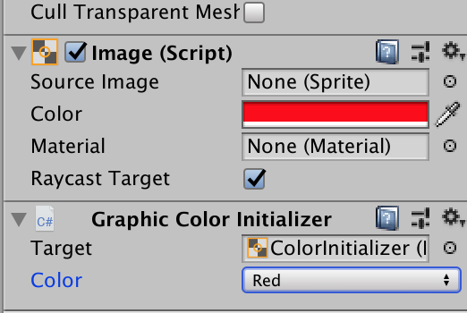
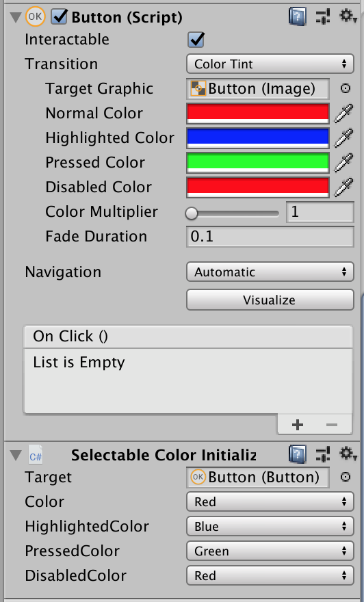
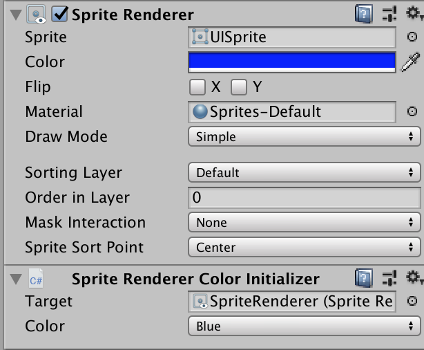
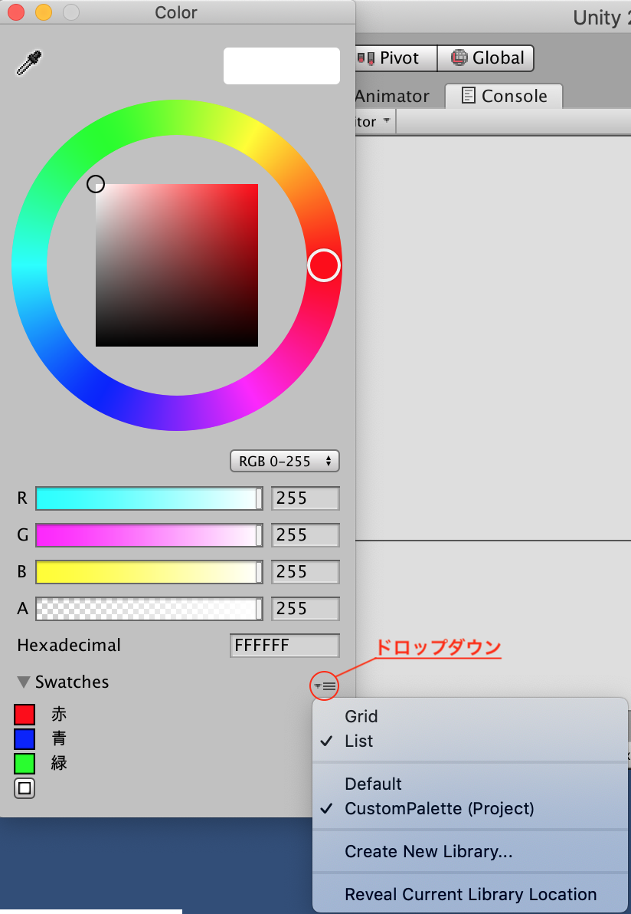
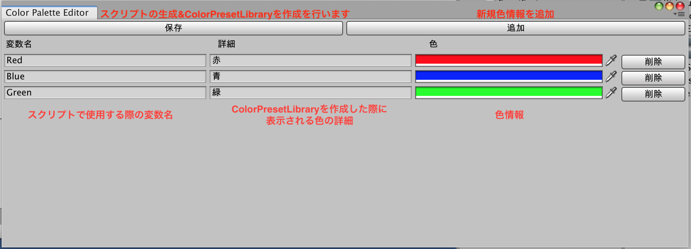

# KrColorPalette
Color情報をスクリプトに定義&ColorPresetLibraryの作成を行うエディタ拡張

## UnityVersion
2018.4.7f1

## Installation
[unitypackage](KrColorPalettePackage.unitypackage)

## Usage

### From Script :

#### スクリプトで指定する場合
```
image.color = KrColorPalette.Palette.Red;
```

#### スクリプトをアタッチする場合

TextやImageなどのGraphicを継承しているオブジェクトの場合は <br>
`GraphicColorInitializer` をアタッチしてください<br>
`GraphicColorInitializer` はAwakeのタイミングで指定されたカラーをTargetに設定します



ButtonなどのSelectableを継承しているオブジェクトの場合は <br>
`SelectableColorInitializer` をアタッチしてください<br>
`SelectableColorInitializer` はAwakeのタイミングで指定されたカラーをTargetに設定します



SpriteRendererの場合は <br>
`SpriteRendererの場合はColorInitializer` をアタッチしてください<br>
`SpriteRendererの場合はColorInitializer` はAwakeのタイミングで指定されたカラーをTargetに設定します



### From Edit Color :

カラー情報を追加を行うとドロップダウンにcolorsアセットのファイル名が追加されます<br>
変更するとSwatchesがカラー情報を追加を行った内容になります
表示設定をListにしておくと色情報の隣に詳細が表示されます<br>



## Tools
### スクリプト&colorsアセットを生成するパスを定義
`Tools > Kirierurein > ColorPalette > CreatePathDefine`

GenerateFilePathDefineアセットが生成されます

| filedName | 概要 |
| --- | --- |
| colorAssetPath | colorsアセットの生成パス<br>Editorフォルダ直下にファイルを生成しないとColorPresetLibraryが認識しないので注意 |
| defineScriptPath | Palletクラスのファイルの生成パス |

### カラー情報を追加,削除
`Tools > Kirierurein > ColorPalette > ColorPaletteEditor`



## License
[MIT License](LICENSE)
